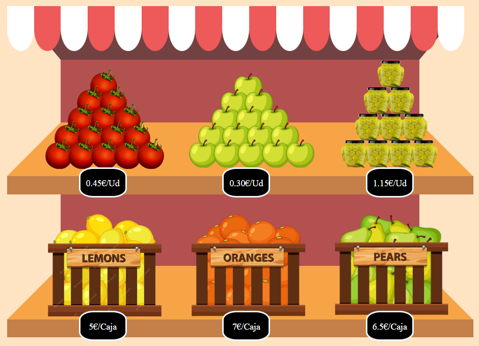
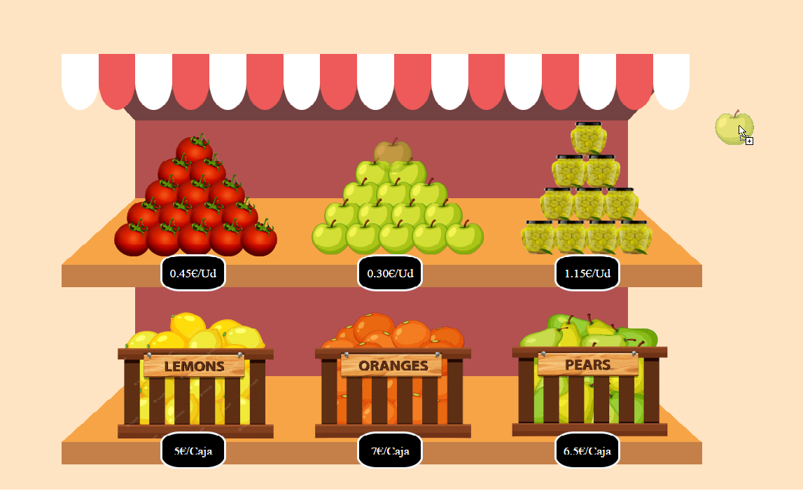
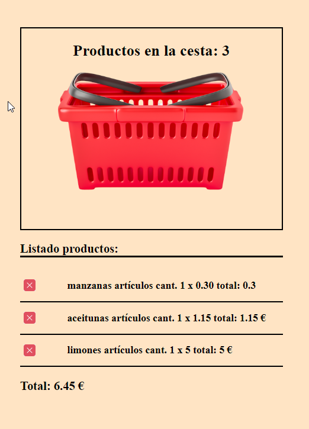
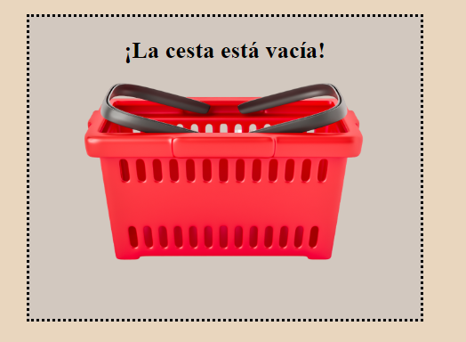
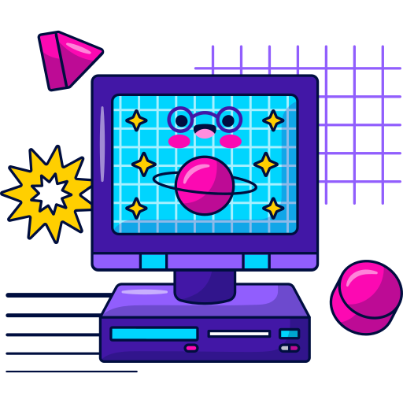

# 
 Showcase Dinámico  #
---

## :open_book: Descripción ##

Proyecto final dentro del curso **Programación desde cero** impartido por la academia GeeksHubs 

Es el diseño de un mostrador de alimentos dinámico, con un carrito o cesta de la compra y un listado donsde aparacen los productos añadidos.

Índice del documento:
- [Características](#item1)
- [Tecnología utilizada](#item2)
- [Sobre el autor](#item3)

---

## :eyes: Caracteristicas ##

En el mostrador dinámico se encuentran una serie de productos con sus precios correspondientes.

Para añadir a la cesta de la compra se usa el Drag & Drop (arrastrar y soltar) haciendo así la funcionalidad de añadir productos a la cesta algo muy sencillo e intuitivo.

Al ir añadiendo productos a la cesta de la compra, se crean diferentes lineas en el listado de productos, una linea por cada producto diferente que se añada.
Al añadir los productos se actualiza la lista y se hace una suma tanto de las cantidades como del precio de los mismos.

También existe la posibilidad de quitar de la cesta de la compra el artículo que no queramos, esto se hace al clickear en el aspa adjunta a cada linea de producto. Al quitar un producto se actualiza el precio del total de la compra.

Para añadir algo más de efecto visial, al comenzar a arrastrar el producto deseado, el fondo de la cesta y el borde de la misma cambia de color y forma. 

Aunque para el proyecto no se solicitaba que fuera responsive, se han incluido alguna mediaquery para ajustar un poco el layout a las pantallas más pequeñas.

---

##  Tecnología utilizada ##

El proyecto está realizado con las diferentes caracteristicas que ofrecen HTML5, CSS3, JavaScript.

También como extra a la tecnología utilizada, he puesto en práctica las funcionalidades de Git Flow.

---

##    Autor ##

  * Sergio Ruiz - Desarrollo y Programación

 
 
 
 Giphy